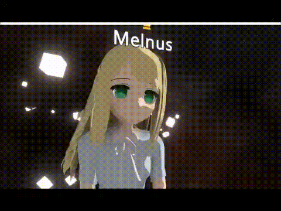

# Top

## Welcome to My Homepage





## 目次

### 連絡


[contact-request](info/contact-request/)


### 個人としての説明


[about](info/about/)


### 成果物


[games-and-products](info/games-and-products/)



[line-stamp.md](info/games-and-products/line-stamp.md)


### ３Dモデル


[models.md](info/models.md)


### そのほかのリンク


[kassp-1](info/kassp-1/)



[links.md](info/links.md)


### Memo > Links


[links.md](memo/links.md)


## その他の活動

### NeosVRの日本語Wiki



### NeosVRJP-Techbook　作例＆チュートリアルをまとめるサイト



### VRアバター準備横断ガイド（作成〜アップまで）


