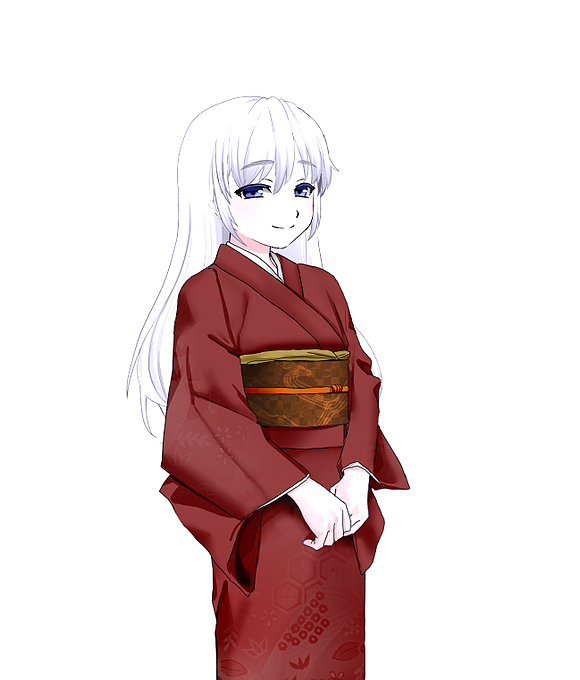

# 伺か（SSP）

SSP　伺か用ゴースト「ツグネ」

​

　SSPというデスクトップマスコットアプリ用のキャラクターです。ダウンロードボタンからnarというものをダウンロードしてSSPに放り込んでください。

​

※注意

​narと呼ばれるものをダウンロードしたからといってあなたのパソコンに危険が及ぶことはありません。ただキャラクターを表示するプログラム群です。

​

​

[SSPとは](http://ssp.shillest.net/)

[Android版](https://play.google.com/store/apps/details?id=com.dendenfactory.ukagakaforandroid&hl=ja)

​

[​権利意識​（PIXIV）](https://www.pixiv.net/member_illust.php?mode=medium&illust_id=75265004)

[​更新履歴](https://github.com/Melnus/SSP-Tsugune/)

​

[​​追加シェル「水着」​（R18）](https://www.pixiv.net/member_illust.php?mode=medium&illust_id=75293563)

ダウンロード



