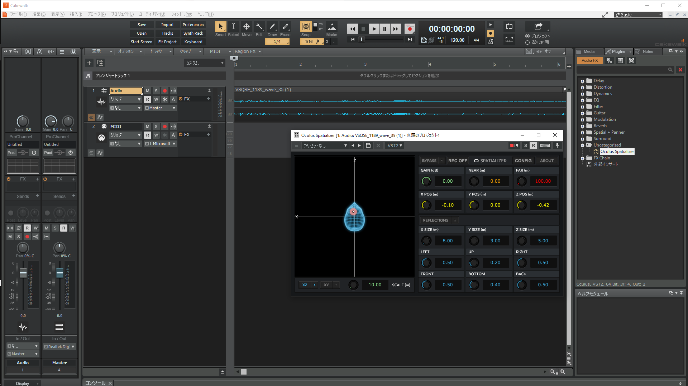

# #002\_VoicevoxでSV作品作成



データ　[https://github.com/Melnus/VOICEVOX\_project002](https://github.com/Melnus/VOICEVOX\_project002)

撮影に使ったUnityプロジェクト以外は全て載せました\
（ライセンス的にいいのかわからないものがあるので）

今回はシチュエーションボイスということで、台本を一から書いて作品をつくった。

## はじめに

　前回、もともとある作品から動画制作を行ったため、ある意味チュートリアル的な「こうやって動画をつくるんだ」という体験が得られた。動画の作業自体もちゃんとしたのは初めてだった。

　今回はもう一歩進んで台本を一から書いて構成を考えるところからがスタートである。\
　セオリーというべきなのかわからないが、よく耳にする、結末から考え始めて逆算して物語をつくるということをした。一番最初に浮かんだイメージは、宇宙船で一人佇む彼女の姿と、コールドスリープの機体だった。これだけだと話として成立しないので、機体から引っ張り出してきて彼女と話をさせるような構造をつくった。

　最後が決まれば最初がなんとなく決まるので、間をうめるために、シチュエーションの要素として音声を軸にしてテーマごとに話をつくった。おそらくこの分け方なら無限に続けられる気がする。また、あとでこの構成のほうがよかったと思ったとき、最初から作業しなおさなくて良い。とても楽だった。

　動画時間に関しては、30分を目指していたが、最終的には15分になった。Youtube基準でいうと長すぎる気がするし、ニコニコだと物語系のもの以外は10分にみたないので、これでも長いという。人はどんどんせっかちになっているというのはある程度真実ではあると思う。推しの配信や動画以外であまり時間を使わなくなった。これはいいことなのかどうなのか......

　　

## 文章について

{% embed url="https://github.com/Melnus/VOICEVOX_project002/blob/main/%E3%82%B3%E3%83%BC%E3%83%AB%E3%83%89%E3%82%B9%E3%83%AA%E3%83%BC%E3%83%97%E3%81%AE%E9%80%94%E4%B8%AD%E3%81%A7%E3%81%9F%E3%81%BE%E3%81%9F%E3%81%BE%E8%B5%B7%E3%81%8D%E3%81%A6%E3%81%97%E3%81%BE%E3%81%A3%E3%81%9F%E3%82%B3%E3%83%9E%E3%83%B3%E3%83%80%E3%83%BC%E3%81%95%E3%82%93%E7%94%A8%E5%8E%9F%E7%A8%BF.md" %}

今回の原稿。

　冒頭にはメモとして[ボイボ寮](https://voicevox.hiroshiba.jp/dormitory/)にある設定を書いてある。書いているうちに私と呼ばせていたり、誰かを呼ぶときに何て呼ぶのか揺らいでしまうので、こういう設定がどこかにあるととても助かる。二次創作ではあるし自由にやればいいのだが、自分の納得がいかなかったのでこうした。~~（原作過激派なので）~~

　原作の設定だと彼女(九州そら)は自分のことを『まーくつー』と呼び、人を呼ぶときは、『～さま』と呼ぶ。文章を考えるときは、できるだけ思いついた文章をVOICEVOXに入れながら彼女の声をきき、場面を想像しながらストーリーを考えた。

　構成ははじめににある通り、最後を考えた後、最初の場面を書き、その間を埋めていった。ただし最初からこの文章を書いたというより、途中の場面の話は音声が決まってから、ある場面では、決めた文章では時間がスカスカになってしまったので、編集ソフトにいれる段になってから追加したものもあるのでわりと行き当たりばったりではあった。ただ声を聴きながら文章を考えたので、編集の技巧を抜きにしても一応場面は想像できる(かな？)というぐらいにはなった気がする。この辺りはもう少し魅せる技術は必要そうである。\
　\
　このあたり複数人で作業をやっていると自然にここ直したほうがいいよとかできるので、わりとうらやましい。一人でもくもくとしていると、気づかないし、最悪動画ができて**すべてが終わってから**気づくので、何回も見直す必要がある。

　ノベルゲーを一度作ってみたいと思ったことがあったが、この分だと一人でやるのは地獄になりそうなので、しばらくは動画作成や音声作品などで経験値を積みたい。

## 音声出力・編集について

### \*背景音・効果音について

　前回作業後に、どうやってバイノーラルにすんねんと調べていた時に、[oculus spatializer](https://developer.oculus.com/downloads/package/oculus-spatializer-daw-win/)というプラグインであればできるということがわかったので、今回はお試しで使ってみた。参考にしたものにそのときみた動画を張り付けてある。

　プラグインを入れる作業としては、VSTのため;

　・ユーティリティ\
　・Plug-in Manager\
　・VSTAudioEffects\
\
の順でいったん再起動をいれて読み込ませてから音源を入れ、FXから適用するだけだ。

　Oculus Spatializer自体は、『RECOFF』の状態で曲を再生し赤い丸をうごかしてみたらどんな感じかがつかめるだろうと思う。RECOFFをARMEDにしたあと、曲を再生すると、設定した効果を伴ってファイルが保存される。このあたり、一回使ってみないと説明文が理解できないので、かなり苦手意識を感じた。保存された音声は音量が小さかった気がするので、もう少しいじって手になじませる必要がありそうだ。

&#x20;　このOculus Spatializerというプラグイン、なんか見たことあるなと思っていたら、VRで遊んでいたときにそういえばいたなと思い出した。また君か

　Unity版は３Dだったので何も知らなくてもカンでなんとかなるが、DAW版はそもそも使い方が予想できないので、大変だった。

　使ったのは効果音一つだけだったが、元々の音声は椅子から飛び上がるほどのクソデカ音源だったために、わりと聞こえるようになったと思う。ただ、ゲインやポジションだとかなんとなくUnityできいたことがあるがこういったソフトの二次元で三次元を表記しているのがどうしても苦手で、完成したものでもこれで本当にあっているのか、ずっと気になっていた。ここは次回の課題だ。

### \*声の素材について

　前回の反省を活かし、一括書き出しをはじめからせず、一段落ずつを前提として書き出しをした。理由としては、編集がしやすいのと、段落を選んで書き出し直せばもう一回出力できるからだ。一括であっても、編集ソフトに入れて波形を見ながらできなくはないが、かなりめんどくさい作業になるので、こちらのほうが断然楽だ。

　また、プロジェクトファイル自体も重くならないように場面ごとにわけて管理することにした。理由は以下同文。

　声音に関して、今回はノーマルとささやきの両方をつかったので、できるだけノーマルの部分が違和感のないようにした。したが、若干違和感あるような気がする。

　ほかの動画などを見ると書き出した後に修正を加えているような聞こえ方をしているので、こだわるならそのあたりもやるのがいい気はする。ただ私には専門用語すらわからないのでやりかたがわからない。このあたりはおいおいできるようになりたい。

## 背景素材作成について

　ニコニコにはいろんな素材があるので、借りればいいのではあるが、自分でやりたい病なのでBlenderでつくった。

　ここはほとんどつくってUVわけて色をぬっただけなので、とくに書くことはない。強いて言えばアセットを探してきたほうが早かったかもしれないなと思った程度だ。

## 撮影について

　ニコニコのボイロ界隈には便利なことにそういう紙芝居用ツールがあるらしいのだが、私にはそういうバックグラウンドがなかったので、いつもどおりUnityを起動して撮影した。

　立ち絵にはPlaneを正方形にして、元の絵を正方形ではりつけ、Cutoutで透明にしている。余力があれば板ポリでつくってもいいが、透過したほうが早い。~~ペーパーマリオみたい~~

　一瞬しか映らないので、もう少し凝ればよかった気がするが、それは次回もう少しなんとかするとして、ともかく画像として出力していった。このあたり、そもそもUnity側で動画がとれれば編集ソフトにいかなくて済むので、これで完結させてもよかったかもしれない。

　Unity側で完結できるようにすれば、VR対応するときに応用が利くだろうと思うので、作業としては無駄ではないだろうと思う。シェーダーなどもできるだけモバイル向けにしたり、容量を削ればなんとかはなるので、あとは魅せ方の部分だ。

　

## 合成・映像出力について

　前回と同じように、出力したものを合わせる作業。今回は音量の違う音声が複数あり、対して声音は常にささやく音声のため、つねに掻き消えないようにゲインを調整しながらみていく。このソフトでいうとフィルタからゲインをいじる。

　一番気を付けた部分は、波形をみながら会話がかぶらないようにするところ。この音声では二種類の音だけだが、さらに物語に必要な音が増えた場合、一つの要素ごとにどれが前に来てほしいか考える必要があるため、ここは編集ソフトの作業になったときに考えればいいやとは考えず、さきにこうしたいと考えたほうがよい。あとになってから一つずつ作業していくのは、ただの苦痛だ。

　一応二回目なので、とくに難しいことはなかった。場面ごとにわけて動画を出力し、それから一本にした。全体的には技術不足な感じがするが、やりたいことはできたと思うので、一応満足している。人に魅せるという点でいえば、そもそも確認してくれる人がいないので、そこはハマらなければそれまでと考えることにする。すくなくとも、作った自分はハマっているので。

## まとめ＆次回

とりあえずやりたいことはできた。しかし課題もいくつかある、という感じ。

・Oculus Spatializer について理解を深める

・Unity側の動画撮影について

・動画作成の演出に関して

ともかく数をつくらないとうまくなりようもないので、簡単なものをいくつかつくっていきたい。

## 参考にしたもの

oculus spatializerについて



